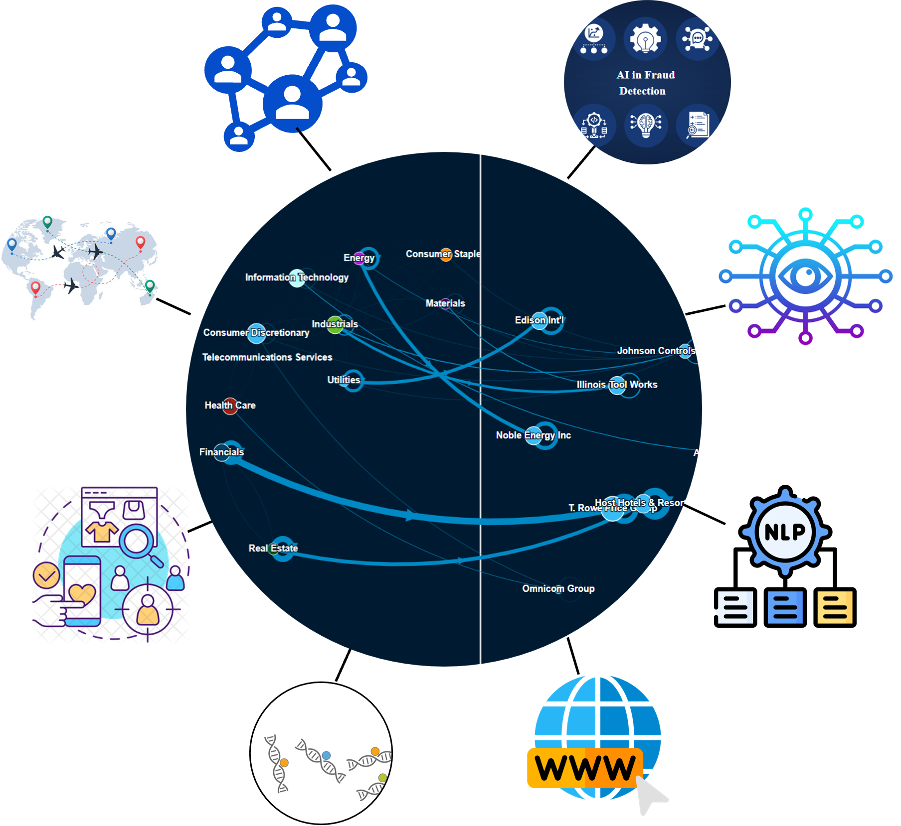
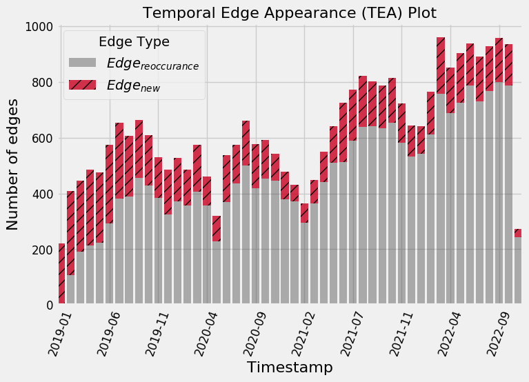
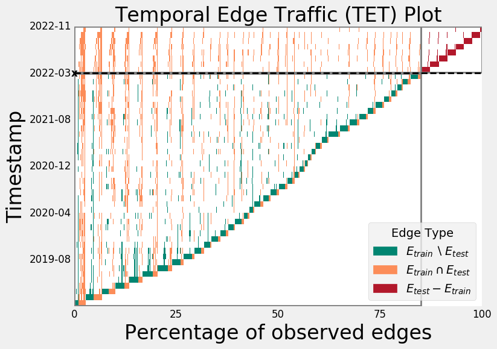
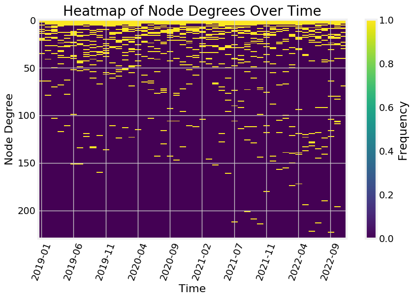
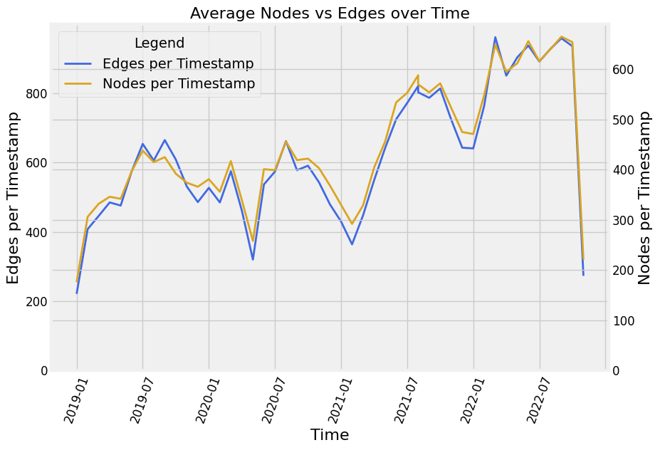
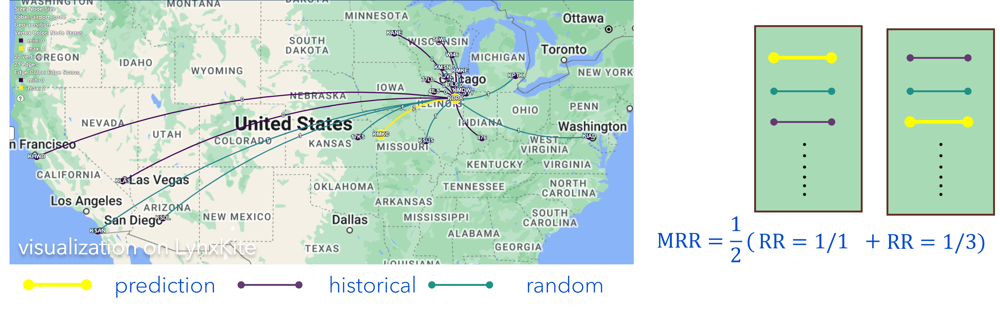
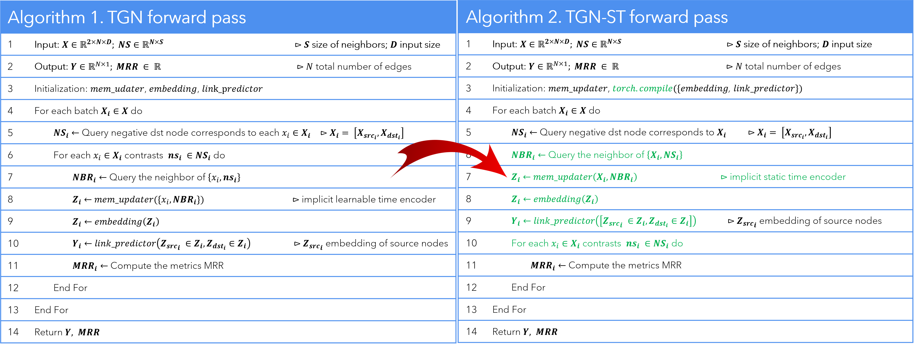

# TGN-ST

Temporal Graph Learning with Application to Large-Scale Flight Traffic Prediction (Hang et al., 2024)

This reporitory contains a Pytorch implementation of the paper TGN-ST (submitted to https://techno-srj.itc.edu.kh/ and under review).

## 1. Introduction

Graph are everywhere!!!

Graph applications:

1. Transportation networks. (i.e. [@Google Maps](https://deepmind.google/discover/blog/traffic-prediction-with-advanced-graph-neural-networks/))
2. Social network (i.e. [@Meta](https://research.facebook.com/publications/revisiting-graph-neural-networks-for-link-prediction/))
3. Financial (i.e. [Lecture](https://snap.stanford.edu/graphlearning-workshop/slides/stanford_graph_learning_Finance.pdf))
4. Computer vison (i.e. [Paper](https://arxiv.org/abs/2212.10207))
5. Natural Language Processing (i.e. [Paper](https://arxiv.org/abs/2106.06090))
6. Web applications (i.e. [Web Image Search](https://europe.naverlabs.com/blog/web-image-search-gets-better-with-graph-neural-networks/))
7. Computational biology (i.e. [@Deepmind](https://deepmind.google/discover/blog/alphafold-using-ai-for-scientific-discovery-2020/))
8. Recommendation systems (i.e. [@Twitter](https://towardsdatascience.com/temporal-graph-networks-ab8f327f2efe), [@Pinterest](https://medium.com/pinterest-engineering/pinsage-a-new-graph-convolutional-neural-network-for-web-scale-recommender-systems-88795a107f48))

## 2. Temporal Graph Learning (TGL)

Systems of interaction can be modeled as graph network with entities as nodes and interaction as edges or links.

Real-world network is inherited with network change evolve over time. New subfield of machine learning is emerged as promising framework to extract strutural and temporal from dynamic graph assuming relational inductive bias and temporal inductive bias, called temporal graph learning.

The number attached to edges are timestamps. Visualized in [Lynxkite](https://lynxkite.com/)

**TGL Methods Taxonomy**

Approaches | GNN-based | Sequence-Based | Graph Walk Based | None
--- | --- | --- | --- |--- 
Memory-based | JODIE | - | CAWN | EdgeBank**
Self-attn -based | TGAT, TCL, GAT | DyGFormer | - | - |
self-attn + Memory based | DyREP, TGN | - | - | - |
MLP-based | - | GraphMixer | - | - | - |
None | GAT*, GraphSAGE*, GCN* | - | - | - |

Note:  
(*) Static graph method  
(**) Pure memorization method

## 3. Flight Network Dataset

TGB [tgbl-flight](https://tgb.complexdatalab.com/docs/linkprop/#tgbl-flight-v2) is a crowd sourced international flight network from 2019 to 2022.

Name | #Nodes​ | #Edges​ | #Steps​​
--- | --- | --- | ---
tgbl-flight | 18,143​ | 67,169,570​ | 1,385​

Geographically visualized of sampled flight network. Visualized in [Lynxkite](https://lynxkite.com/)

### 1. Exploratory Data Analysis (EDA)

Due to large-scale dataset, any graph insight operations are computationally expensive. So, we perform graph subsampling as follow:

- Dynamic Graph Subsampling and Discretization

Graph subsampling perfrom random sampling on a given number of nodes. It is also feasible to give determistic node list or regional name (i.e. continent such as NA, AS, OC, SA, EU). It is futher discretized into a given period (i.e. daily, weekly, monthly, or yearly). The pipeline is illustrated as follow

Python Code:

`TODO`

The resulting sub-graph can be proceed to visualize and analyze as discussed next.

- Dynamic graph visualization

To understand the dynamic and graph structure, it is required to visualized it. Large graph poses very huge challenge in analysis and visualization due to computational resource. So, the whole network is required to perform subsampling for visualization feasible.

By running [Force Atlas 2](https://journals.plos.org/plosone/article?id=10.1371/journal.pone.0098679) algorithm on sampled graph, with node sized by degree and colored by continent.

Airline route during high Covid-19 hit in Feb-21. Visualized in [Gephi](https://gephi.org/)

Airline route back to normal after Covid-19 in Oct-22. Visualized in [Gephi](https://gephi.org/)

Note: North America: pink; European: blue; Asia: Orange; Oceane: red; South America: green.

`TODO: Embed video`

The Force Atlas 2 algorthm is able to group the airport based on their located region. DORD (O'Hare International Airport) has highest number of connection. During high Covid-19 cases, the network become sparser. Very few route is connected between the aiport, especially the airline that connect between the continents.

- Dynamic Graph Analysis

While topological graph visualization provide crucial structural information about the network, it is tedious to understand the evolution of the network through time. [Poursafaei et al.](https://arxiv.org/pdf/2207.10128) and [TGX](https://github.com/ComplexData-MILA/TGX) introduce a novel technique to visualize temporal graph network. 

Temporal Edge Appearance (TEA) plot illustrates the portion of repeated edges versus newly observed edges for each timestamp in a dynamic graph.

Temporal Edge Traffic (TET) plot visualizes the reocurrence pattern of edges in different dynamic networks over time.

Temporal Edge Appearance             |  Temporal Edge Traffic
:-------------------------:|:-------------------------:
  |  

Heatmap of Node Degree over Time             |  Nodes vs Edge over Time
:-------------------------:|:-------------------------:
 | 

Note: the last timestamp is not one month fully aggregated, so the 
chart is relatively low.

From TEA and TET plot, it guides how to select the model as well as the evaluation method as will be discussed next.

For complete visualization, please visit `TODO put repo`

## 4. Evaluation Methods

Due to sparsity of the graph, more stringent method of evaluation is required. Mean Reciprocal Rank (MRR) is most suitable for such task as suggested by [Poursafaei et al.](https://arxiv.org/pdf/2207.10128) and [TGB](https://arxiv.org/abs/2307.01026) by contrasting one positive edge vs 20 negative edges (note exist in the network). A simple evaluation and calculation method is illustrated below

For a given prediction link, 50% of historical edges and 50% of new edge are randomly sampled. It is crucial to test the transductive learning ability as well as the Inductive learning ability of the TGL model.

## 5. Temporal Graph Learning Pipeline

As we gain insight about the data and metric to use, we ready to build a scalable pipeline for learning on temporal graph. an end-to-end pipeline is build and displayed as below.

The script has been tested running under Python 3.10, with the following packages installed (along with their dependencies):

    py-tgb==0.9.2
    torch_geometric==2.5.2
    wandb==0.17.4
    torch==2.2.1+cu121
    torch_cluster==1.6.3+pt22cu121
    torch_scatter==2.1.2+pt22cu121
    torch_sparse==0.6.18+pt22cu121
    torch_spline_conv==1.2.2+pt22cu121
    torchaudio==2.2.1+cu121
    torchdata==0.7.1
    scipy==1.13.0
    triton==2.2.0
    scikit-learn==1.4.2
    networkx==3.2.1
    onnx==1.16.1

Since we need to perform numerous number of experiments, [wandb](https://wandb.ai/) is a great package provided us to do experiment tracking and result visualization. As we are going to use [`torch.compile`](https://pytorch.org/tutorials/intermediate/torch_compile_tutorial.html) framework for FX graph compilation, we need a GPU with higher cuda compatibilyty, i.e. `torch.cuda.get_device_capability() >= 7.0`, `torch >= 2.0` and `torch_geometric >= 2.5`.

`TODO code for running`

## 6. Model Selection

After built TGL pipeline, we can run many experiments without burden the GPU and spent excessive amount of time. The resulting of experiment is illustrated as below.

Test MRR             |  GPU Memory
:-------------------------:|:-------------------------:
  |  

Training Time             |  Validation Time
:-------------------------:|:-------------------------:
 | 

Top Performance (MRR) | Top Efficiency (Training Speed)
:-------------------------:|:-------------------------:
DyGformer: 81% | Edgebank (No Training)
GraphMixer: 80.57% | JODIE: 2.223s
CAWN: 78.47% | TGN: 2.649s
TGN: 71.01% | TCL: 5.586s
JODIE: 68.95% | GraphMixer: 6.111s

**TGN is selected to balance the training speed and performance.**

## 7. Temporal Graph Network with Static Time Encoder (TGN-ST)

After model selection, we can gain insight into the selected model. [onnx](https://onnx.ai/) captures the FX graph and provides below visualization of [TGN](https://arxiv.org/abs/2006.10637) model for ease of understanding. Three main modules among 5 modules of TGN are delved using onnx. An example of graph compilation using `torch.compile` is illustrated in Time Encoder.

Time Encoder | Embedding | Decoder
:-------: | :-------: | :-------:
 |  | 

To improve the model performance, [GraphMixer](https://arxiv.org/abs/2302.11636) suggestes to used static time encoder to imporove the model training stability.

To improve the model efficiency, `torch.compile` are wrapped around the `embedding` and `link_predictor` modules. `torch.compile` is an PyTorch API that solves the graph capture using TorchDynamo and paire with backend TorchInductor to compile into fast code such as OpenAI [Triton](https://www.eecs.harvard.edu/~htk/publication/2019-mapl-tillet-kung-cox.pdf) code for training on GPU.

Futhermore, the TGN forward pass in algorithm 1 implemented by [pytorch_geometric](https://github.com/pyg-team/pytorch_geometric/blob/master/examples/tgn.py) poses computational cost in the standard TGN forward pass (lines 
7-10). This bottleneck arises from the loop that iterates through each negative neighbor query, `memory_updater`, `embedding`, and `link_predictor` for every node. To address this and reduce computational cost, we propose the TGN-ST forward pass algorithm in Algorithm 2. TGN-ST leverages the capabilities of modern GPUs with parallel processing architectures. Unlike the standard approach, TGN-ST avoids the need for individual loops for each node's negative neighbors (lines 6-9 in Algorithm 2). Instead, it exploits the GPU's ability to perform large matrix operations simultaneously.

## 7. Hyperparameter Tuning

We performed 200 random search experiments on wandb. The main observation are listed below:
- AdamW with cosine annealing is the best traininign strategy
- Standard SGD is the worst optimizer
- Leaky_relu is the worst activation function
- Batch size and patience number is directly impact the training speed

Hyperparameter Sweeping | Hyperparameter Sweeping Top Performers
:-------: | :-------:
 | 

To trade-off performance and efficiency, the most suitable parameter are selected and evaluated on full dataset.

`TODO code for tuning`

## 8. Results

**TGN-ST** sets new state-of-the-art result with **72.49%** MRR with **15%** faster training and **5x** validation time.

Training | Validation
:-------: | :-------:
 |
 |

The consistent improvement on both dataset provides evident for the generalizability of the pipeline and TGN-ST forward pass algorithm.

<table>
    <thead>
        <tr>
            <th>Datasets</th>
            <th>Model and Gains</th>
            <th>Test MRR (%)</th>
            <th>Training/Epoch (s)</th>
            <th>Validation/Epoch (s)</th>>
        </tr>
    </thead>
    <tbody>
        <tr>
            <td rowspan=3>Sample</td>
            <td>TGN</td>
            <td>72.94</td>
            <td>2.3743</td>
            <td>9.8546</td>
            </tr>
        <tr>
            <td>TGN-ST</td>
            <td>80.19</td>
            <td>1.7763</td>
            <td>2.2687</td>
        </tr>
        <tr>
            <td>Gain</td>
            <td>7.25</td>
            <td>0.598 (25%)</td>
            <td>7.586 (4.34x)</td>
        </tr>
        <tr>
            <td rowspan=3>Full Dataset</td>
            <td>Vanilla TGN</td>
            <td>70.50</td>
            <td>2800</td>
            <td>9485</td>
        </tr>
        <tr>
            <td>TGN-ST</td>
            <td>72.49</td>
            <td>2366</td>
            <td>1887</td>
        </tr>
        <tr>
            <td>Gain</td>
            <td>1.99</td>
            <td>434 (15%)</td>
            <td>7598 (5.02x)</td>
        </tr>
    </tbody>
</table>
